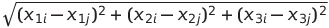
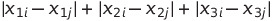

# Instructions

You will submit an HTML document to Canvas as your final version.

You may work with **one** other person for this assignment.  Make sure both your names are on the HTML document, and you should **both** upload a copy of the assignment to Canvas.

Your document should show your code chunks/cells as well as any output.  Make sure that only relevant output is printed.  Do not, for example, print the entire dataset in your final knitted file.

Your document should also be clearly organized, so that it is easy for a reader to find your answers to each question.

There may be a small penalty for submissions that are difficult to read or navigate.


```{r, include = FALSE, eval = FALSE}
library(tidyverse)
library(tidymodels)

whr <- read_csv(here::here("Assignments", "data", "world-happiness-report.csv"))
whr2 <- read_csv(here::here("Assignments", "data", "world-happiness-report-2021.csv"))

ref <- whr2 %>% select(`Country name`, `Regional indicator`)

whr %>%
  left_join(ref) %>%
  janitor::clean_names() %>% 
  filter(year < 2020) %>%
  select(country_name, 
         regional_indicator,
         life_ladder,
         log_gdp_per_capita,
         healthy_life_expectancy_at_birth, 
         social_support,
         freedom_to_make_life_choices,
         generosity,
         perceptions_of_corruption,
         year) %>%
  rename(healthy_life_expectancy = healthy_life_expectancy_at_birth,
         happiness_score = life_ladder) %>%
  write_csv(here::here("Assignments", "data","whr_clean.csv"))
  

whr2 %>% 
  janitor::clean_names() %>%
  select(country_name, 
         regional_indicator,
         logged_gdp_per_capita,
         healthy_life_expectancy, 
         social_support,
         freedom_to_make_life_choices,
         generosity,
         perceptions_of_corruption) %>%
  rename(log_gdp_per_capita = logged_gdp_per_capita) %>%
  mutate(
    year = 2020
  ) %>%
  write_csv(here::here("Assignments", "data","whr_2020.csv"))
  
```

# The Data

```{r, include = FALSE, eval = FALSE}
library(tidyverse)
library(tidymodels)
```


The dataset we will use for this assignment pertains to the [World Happiness Report](https://worldhappiness.report/).  The following dataset contains information about six measurements of well-being in a country:

* The Gross Domestic Product (GDP) per capita  *(dollars; log scale)*

* The life expectancy at birth of a healthy citizen *(years)*

* The social support of friends and family *(scale of 0-1, based on surveys)*

* The freedom to make life choices in the society *(scale of 0-1, based on surveys)*

* The generosity of the society *(scale of -1 to 1, based on surveys)*

* Perception of corruption in government of the country *(scale of 0-1, based on surveys)*


The data also records the year of measurement and the region of the country.


Although it is not a formal question on this assignment, you should begin by reading in the dataset and briefly exploring and summarizing the data, and by adjusting any variables that need cleaning.

```{r, echo = TRUE, eval = FALSE}
whr <- read_csv("https://www.dropbox.com/s/aau732ery3uujct/whr_clean.csv?dl=1")
```


# Part One: Happiness Scores

The World Happiness Report uses their own, privately-determined formula to combine the six measures of life quality into a "happiness score".  The dataset also contains this score, on a scale from 1 to 10.


*Hint: The following two questions require you to fit only one model each.*


#### Q1:  Happiness over time

Is the happiness in the world changing linearly over time?  Fit a simple linear model and interpret the results to address this question.


Was the happiness score approximately the same in all the years?  Convert `year` to a factor variable, and fit a simple linear model to address this question.


```{r, include = FALSE, eval = FALSE}
lin_mod <- linear_reg() %>%
  set_mode("regression") %>%
  set_engine("lm")

whr_fit <- lin_mod %>%
  fit(happiness_score ~ year, data = whr)

whr_fit$fit %>% summary()


whr_fit_2 <- lin_mod %>%
  fit(happiness_score ~ factor(year), data = whr)

whr_fit_2$fit %>% summary()
```


#### Q2: Happiness Equation

How is each of the six measures of life quality weighted in calculating this score?  
Fit a model to estimate the weights, and interpret the coefficients.
Which measures of life quality does the WHR consider to be most important to a country's happiness?


*Hint: It is important to put all the metrics on the same scale first, since they are all in different units.*

```{r, include = FALSE, eval = FALSE}
whr_rec <- recipe(happiness_score ~ log_gdp_per_capita + healthy_life_expectancy + social_support +
        freedom_to_make_life_choices + generosity + perceptions_of_corruption,
        data = whr) %>%
  step_normalize(all_numeric(), -happiness_score)

whr_wflow <- workflow() %>%
  add_recipe(whr_rec) %>%
  add_model(lin_mod)

whr_fit <- whr_wflow %>%
  fit(whr) %>%
  pull_workflow_fit() 


whr_fit$fit %>%
  summary()

preds <- whr_fit %>% 
  predict(new_data = whr)
```

```{r}
lin_reg <- linear_reg() %>%
  set_engine("lm") %>%
  set_mode("regression")

whr_rec <- recipe(happiness_score ~ log_gdp_per_capita + healthy_life_expectancy + 
                    social_support + freedom_to_make_life_choices + generosity + perceptions_of_corruption + 
                     regional_indicator, data = whr) %>%
  step_normalize(all_numeric(), -happiness_score)  %>%
  step_dummy(all_nominal())# %>%
  #step_interact(terms = ~ log_gdp_per_capita : healthy_life_expectancy) %>%
  #step_interact(terms = ~ healthy_life_expectancy : social_support) %>%
  #step_interact(terms = ~ log_gdp_per_capita : social_support)

whr_flow <- workflow() %>%
  add_recipe(whr_rec) %>%
  add_model(lin_reg)

whr_fit <- whr_flow %>%
  fit(whr)

whr_fit %>% 
  pull_workflow_fit()

whr_fit %>% 
  predict(new_data = whr)

str(whr)

whr <- whr %>%
  mutate(predicted_happiness = preds$.pred,
          residuals = happiness_score - predicted_happiness)

whr %>%
  ggplot(aes(x = happiness_score, y = residuals)) +
    geom_point()
```


# Part Two:  Predicting life expectancy (linear model)

Suppose we would like to know how various quality-of-life measurements impact a 
country's life expectancy.  We plan to use the other five metrics, as well as the 
region of the country, to try to predict the life expectancy.

Explore many possible candidate models.  You should consider, within reason:

* Which variables should be included or omitted

* Possible interaction terms

* Polynomial terms of the variables (hint: you can use the function `step_poly(<variable name>, degree = 2)` to add polynomial terms in a `recipe`)

* *(optional)* Log-transformations or square root transformations of variables that appear skewed  (Hint: You can use the functions `step_log()` or `step_sqrt()` in a `recipe`)

Of course, I do **not** expect you to try every possible combination of the above.
Instead, you should come up with a reasonable approach that lets you eliminate many model
options without trying every single one.

Do **not** include the code and results for every single candidate you try in the writeup for this assignment.  Instead, supply the following:

#### Q1: Summary of approach

Write a short description (bullet points are fine) of your process in narrowing down your model.

How did you approach this problem, without spending hours upon hours fitting  and cross-validating zillions of models?

For example:

> I first fit models on each predictor by itself for polynomial 1 and polynomial 2, to determine if I should use any polynomial terms.  I found that [variable] should be polynomial 2 but the rest should not.  Then, I ...


#### Q2: Three example candidates

Choose the three best candidate models among those you tried.  

Supply your code and results for comparing these models, and discuss how you decided which *one* model was the best one.

#### Q3:  Final model

Summarize the results from your final model.  Don't forget to fit your final model
on the full dataset, even if you used *test/training* data or *cross-validation* 
during the model selection process.

Include a plot of the residuals and discussion of what you see, and interpretations of the coefficients and metrics.


# Part Three: Predicting life expectancy (k-nearest-neighbors)

Now we will find the best KNN model for predicting life expectancy.

Consider only the three top candidate models from **Part Two**.

#### Q1: Tuning K

For **each** of your top three candidate models from Part Two, Q2, find the best
choice of **K**.  Show all your work, and provide a brief summary at the end.

> For Model 1, we choose a K of [something] because [reasons].  For Model 2, ...

#### Q2: Best model

Fit and report your single best model from Q1.

You should include:

* An argument for your choice of K, including a plot.

* A plot of the residuals


#### Q3: Different distance metrics

So far, we have only fit KNN models where distance between observations is measured
in **Euclidean distance**.  That is, if we have predictors $X_1, X_2, X_3$, then the 
distance between observations $i$ and $j$ is:



This is not the only way to measure distance between observations!  Consider another
option, the **absolute distance**:



We can change the option of the distance metric in our model specification to be
"power of one", i.e., absolute values, instead of the default power of 2 for Euclidean distance:

```{r, eval = FALSE}
knn_mod <- nearest_neighbor(k = 5, dist_power = 1)
```


Using the same predictors you chose in Q2, find the best choice of $K$ for a KNN model using absolute distance.  How does this model compare to the one from Q2?  Conceptually, why would you get a different answer using these two different distance metrics?


# Part Four: Predicting on new data

The following code will load up a dataset of the World Happiness Report from 2021, 
pertaining to happiness measurements in the year 2020.

```{r, eval = FALSE}
whr_new <- read_csv("https://www.dropbox.com/s/h4kgksgawui3n5z/whr_2020.csv?dl=1")
```
Use your **one** best *least-squares regression* model to predict the life expectancy of all countries.
Use your **one** best *KNN* model to predict the life expectancy of all countries.

Which model did a better job predicting the true values in the new data?

(We sometimes call this new data - that was not involved in the **cross-validation** process or in the final model fitting - the **validation** set.  It is the "Ultimate" test set, that only gets to be used once ever.)


# Part Five:  Discussion Questions

For these questions, you do __not__ have to actually perform any of the computations described.
However, if the conceptual answer is not obvious to you, it may help to do so!


#### Q1:  Parametric and Non-Parametric

Make an argument for why a **parametric** method, like least-squares regression, might be preferred in this task.  

Then make an argument for why a **non-parametric** method, like K-Nearest-Neighbors, might be preferred.

Your arguments should be *conceptual*, not numeric.  That is, your answers should relate to the data context, assumptions, and goals; not the MSE or similar metrics that you calculated for any specific model fit.

#### Q2:  Interpretation and Prediction

If your only goal were **interpretation**, which of the candidate models (from *any* section of the assignment) would you have chosen?  Why?

If your only goal were **prediction** on future data, which of the candidate models would you have chosen?  Why?


#### Q3:  Standardization

Consider your final best least-squares regression model from Part Two, Q3.
Suppose we fit this model again, but this time, we normalize **all** of the quantitative variables.

Will anything change?  Give a (conceptual) argument for why this is true.


#### Q4:  Standardization II

Consider your final best KNN model from Part Three, Q3.
Suppose we fit this model again, but this time, we normalize **all** of the quantitative variables.

Will anything change?  Give a (conceptual) argument for why this is true.


#### Q5: Quantitative or Categorical?

In Part One, Q1, you discovered that (spoiler alert!) the `year` variable did **not** have a linear relationship with the `happiness_score`, but that when we treated `year` as categorical, it did have some relationship.

Suppose we add the predictor `year` to our final model as a **categorical variable** and fit the model on all the data. Then, we use this new model to predict on the 2020 data.

What is wrong with this plan?


# Challenges:  

## Challenge 1: Weighting distances in KNN

The `nearest_neighbor()` model specification function has a `weight_func` argument.

This is used to weight the nearest-neighbor observations by the **distances** to the target observation; 
that is, instead of simply averaging the 5 closest neighbors, we would weight the "vote" from the first closest neighbor more strongly than the vote from the 5th.

Possible values of the `weight_func` argument are: "rectangular", "triangular", "epanechnikov", "biweight", "triweight", "cos", "inv", "gaussian", "rank", or "optimal".

For **10 Challenge Points**, try one these weightings on your best KNN model.  Describe the weighting scheme you chose (e.g., what does "rectangular" weighting mean?)  Was your weighted model better?


## Challenge 2:  Weighting predictors in KNN

Suppose we decided we wanted to weight the **predictors** in the KNN, so that some are given more importance (i.e, contribute more to the distance calculation) than others.

This is not a built-in argument to the `nearest_neighbor()` function, because it is not a *model specification* question.  

Instead, it is a *data pre-processing* question, since it is specific to the particular predictors of a particular dataset.  To weight predictors, we would simply multiply the more important ones by a larger number than the less important ones.

For **10 extra Challenge Points**:  Use the coefficients of a corresponding *least-squares* regression to weight the predictors in your *KNN* model.  Compare the results of this new KNN model to the unweighted one.  Which was better?
